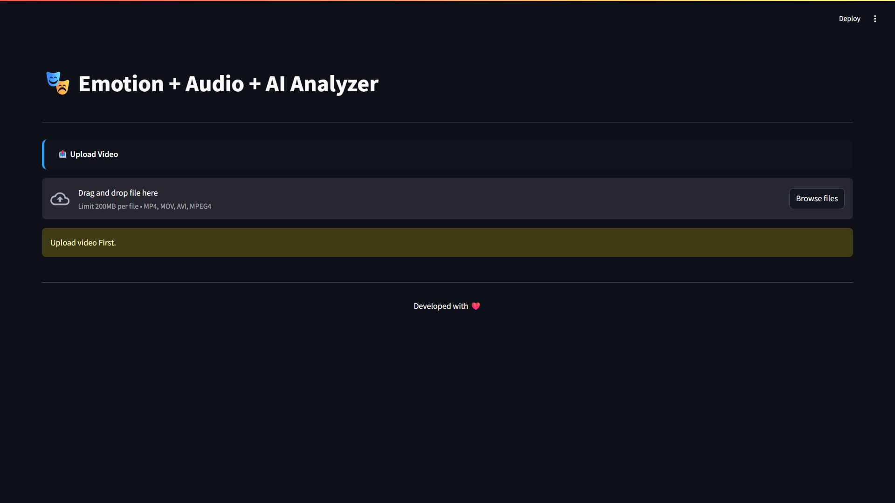
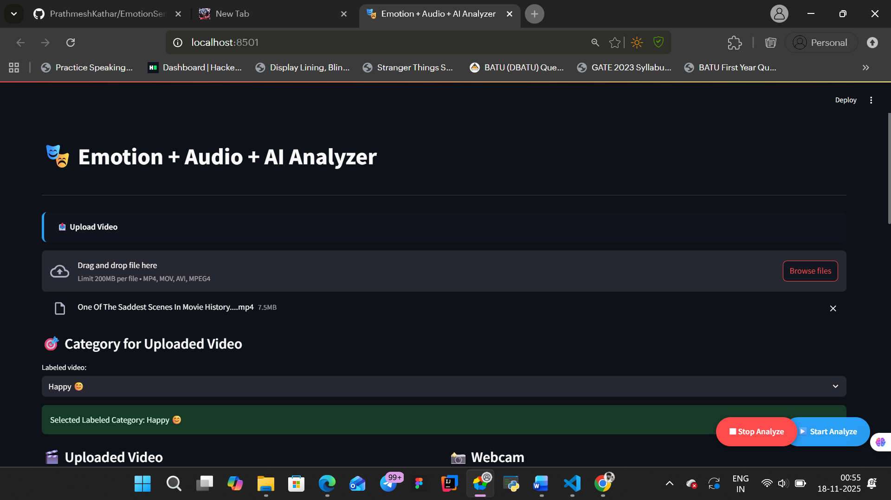
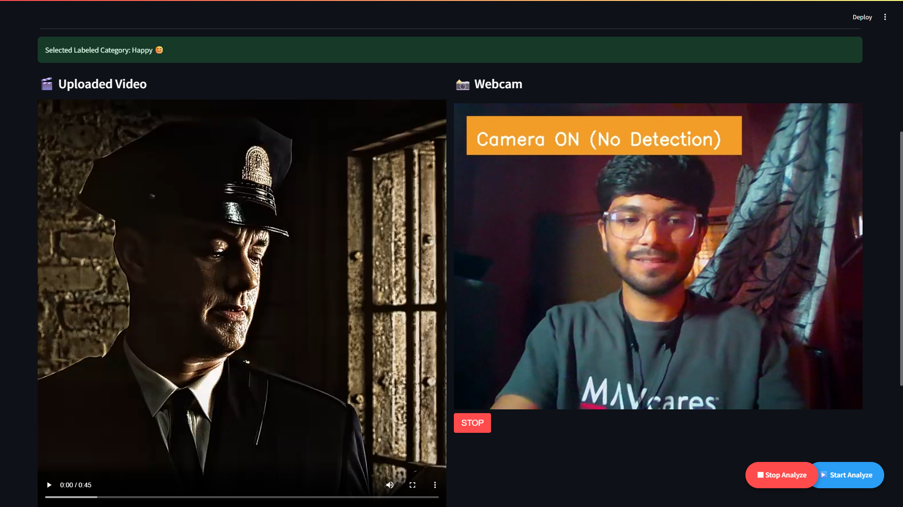
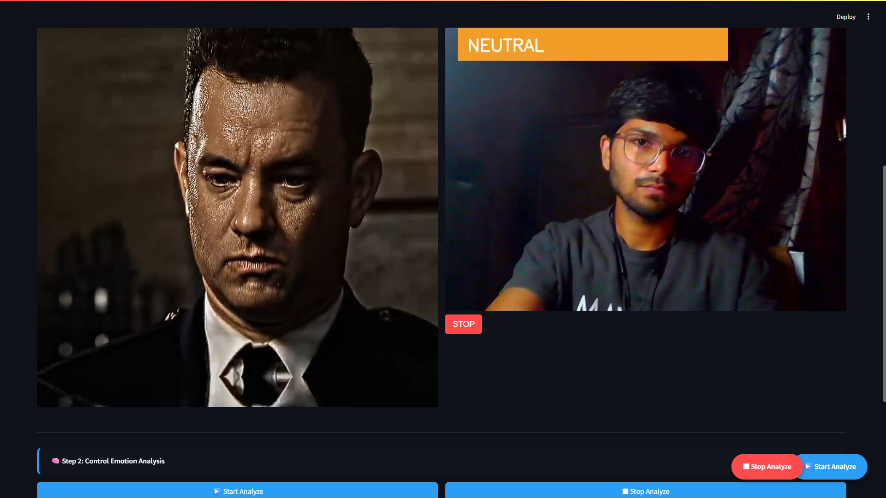
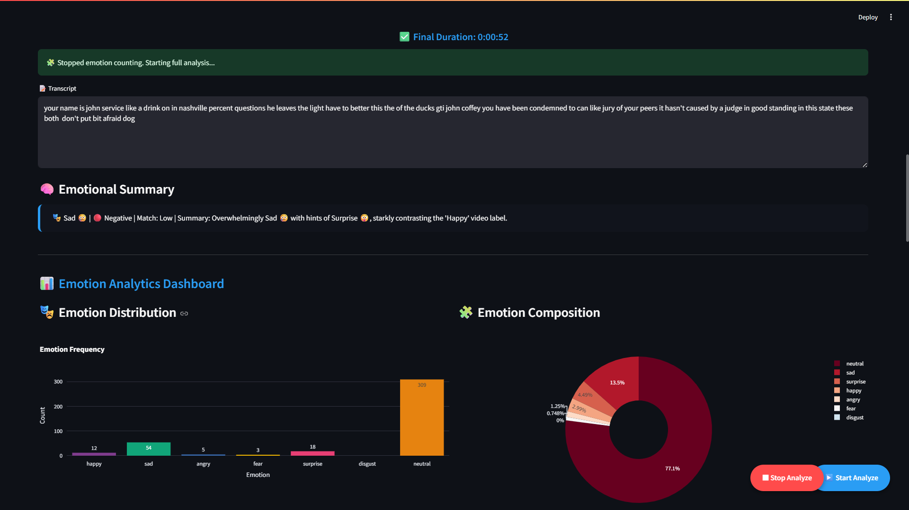

# 🎭 Emotion + Audio + AI Analyzer
Multimodal Real-Time Emotion Understanding System

**DeepFace + Vosk + Gemini + Streamlit**

## 📝 Overview

The Emotion + Audio + AI Analyzer is a multimodal AI system that combines:

- Real-time webcam emotion detection
- Video processing → audio extraction + speech-to-text
- AI emotional summary using Google Gemini

Built using Streamlit, DeepFace, Vosk, FFmpeg, and Gemini LLM.

## 📸 Screenshots

### Main Interface


### Real-Time Emotion Detection


### Video Upload & Processing


### Emotion Analytics Dashboard


### AI Summary Results



## 🚀 Features

### 🎥 Real-Time Webcam Emotion Detection
- Live webcam using `streamlit-webrtc`
- Emotion detection using DeepFace
- Detects: Happy, Sad, Angry, Fear, Disgust, Surprise, Neutral
- Controls: Start Camera, Start Analyze, Stop Analyze

### 🎬 Video Upload + Automatic Processing
- Supports `.mp4`, `.avi`, `.mov`
- Extracts audio using FFmpeg
- Converts speech to text using Vosk (offline ASR)
- User selects expected emotion category for better LLM summaries

### 🤖 AI Emotional Summary (Gemini API)
- Short, crisp emotional summary
- Highlights dominant emotions
- Predicts final emotional tone (one word)

### 📊 Emotion Analytics Dashboard
Includes:
- Emotion frequency graph (Plotly)
- Emotion distribution chart
- Total processing time
- Full transcript
- AI emotional summary

## 🏗️ Project Structure
```
emotion_video_analyzer/
│── app.py
│── requirements.txt
│── .env
│── processing/
│   ├── emotion_detector.py
│   ├── audio_extractor.py
│   └── speech_to_text_vosk.py
│── utils/
│   ├── llm_summary_gemini.py
│   └── analytics_dashboard.py
│── docs/
│   └── screenshots/
│       ├── main_interface.png
│       ├── realtime_detection.png
│       ├── video_upload.png
│       ├── analytics_dashboard.png
│       └── ai_summary.png
│── temp_audio/
```

## 📦 Installation

### 1️⃣ Clone the Repository
```bash
git clone https://github.com/PrathmeshKathar/EmotionSense-AI-Multimodal-Emotion-Speech-Analyzer.git
cd emotion_video_analyzer
```

### 2️⃣ Create and Activate Virtual Environment
```bash
python -m venv venv

# Windows
venv\Scripts\activate

# Mac/Linux
source venv/bin/activate
```

### 3️⃣ Install Dependencies
```bash
pip install -r requirements.txt
```

### 4️⃣ Install FFmpeg
Required for audio extraction. Download from: https://ffmpeg.org/download.html  
Make sure it's added to your PATH.

## 🔑 Environment Variables

Create an `.env` file:
```env
GOOGLE_API_KEY=your_gemini_api_key_here
```

Download Vosk model (example):
```
vosk-model-small-en-us-0.15/
```

Place it in the project root.

## ▶️ Run the Application
```bash
streamlit run app.py
```

Open in browser: http://localhost:8501

## 🔄 Application Workflow

1. Upload video
2. Start Camera (preview)
3. Start Analyze → emotion detection begins
4. Stop Analyze → audio extracted
5. Speech converted to text
6. Gemini generates emotional summary
7. Dashboard displays results

## 🧠 Tech Stack

| Component | Technology |
|-----------|-----------|
| UI | Streamlit |
| Webcam | streamlit-webrtc |
| Emotion Detection | DeepFace |
| Speech-to-Text | Vosk ASR |
| Audio Processing | FFmpeg |
| LLM | Gemini 2.0 / 2.5 Flash |
| Visualization | Plotly |

## 📊 Expected Performance

| Module | Accuracy |
|--------|----------|
| DeepFace Emotion Detection | 85–93% |
| Vosk ASR (WER) | 8–12% |
| LLM Summary | High accuracy |

## 🛠️ Troubleshooting

**❌ FFmpeg Not Found**  
→ Add FFmpeg to PATH and restart terminal.

**❌ Vosk Model Missing**  
→ Ensure the folder exists: `vosk-model-small-en-us-0.15/`

**❌ Webcam Not Starting**  
→ Try Chrome/Edge, clear cache, restart browser.

**❌ Gemini API Failing**  
→ Check `.env` and API key validity.

## 🔮 Future Enhancements

- Whisper STT integration
- Time-series emotion timeline
- PDF export of results
- Multi-person emotion detection
- Transcript sentiment analysis

## 👨‍💻 Author

**Prathmesh Kathar**  
GitHub: [https://github.com/PrathmeshKathar](https://github.com/PrathmeshKathar)

## 🪪 License

MIT License © 2025 Prathmesh Kathar

---

⭐ If you found this project helpful, please consider giving it a star!
